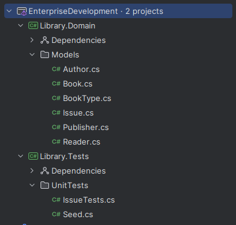
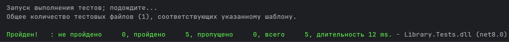

# 📚 Enterprise Development — Lab 1
**Variant 72 — Library**

---

## 📖 Task
Implement an object data model for the domain area **"Library"**, with unit tests written using **xUnit** and LINQ queries.  
Test data is defined **manually** in a fixed dataset to ensure deterministic results.

---

## 🏗 Domain model

The subject area is a **Library**.  
Each entity represents a part of the library system. Dependencies are organized to reflect real-world relationships:

- **Author**  
  Stores information about book authors. Each author has initials and a last name.
  > In the description this entity is considered many-to-many with `Book`, however in implementation it is stored as a collection inside the `Book` entity.

- **Publisher**  
  A reference entity that represents publishing houses (e.g., *Eksmo*).
    - One publisher may release many books.

- **BookType**  
  A reference entity that stores categories of books (e.g., *Novel*, *Textbook*).
    - Helps classify each book.

- **Book**  
  Central entity that represents a library book.  
  Includes title, publication year, catalog code, and references to **Publisher**, **BookType**, and a list of **Authors**.

- **Reader**  
  Represents a library visitor.  
  Stores full name, address, phone number, and registration date.
    - One reader may borrow multiple books.

- **Issue**  
  Represents a book borrowing record.  
  Stores the link to **Book**, link to **Reader**, issue date, and duration in days.

---

## 📂 Project structure  

---

## 🔗 Dependencies between entities

- **Book → BookType** (many-to-one)
- **Book → Publisher** (many-to-one)
- **Book → Authors** (stored as a collection; conceptually many-to-many)
- **Issue → Book** (many-to-one)
- **Issue → Reader** (many-to-one)
- **Reader → Issue** (one-to-many)

---

## 🧪 Unit Tests

The following queries were implemented and tested:

1. **Issued books ordered by title**  
   Returns all issued books sorted alphabetically.

2. **Top 5 readers by books read in a given period**  
   Filters `Issue` by date, groups by `Reader`, counts books, and returns the top 5.

3. **Readers with the longest issue period (ordered by name)**  
   Finds the maximum `DaysCount` per reader, sorts by full name.

4. **Top 5 publishers by issued books in the last year**  
   Groups issues by publisher, counts books, sorts descending.

5. **Top 5 least popular books in the last year**  
   Groups issues by book, counts usage, sorts ascending.

---

## ✔️ Test results

All tests passed successfully.  
Each test uses **fixed reference data** from `Seed.cs`, with **expected results hardcoded** for verification.

---

## 📌 Notes

- All entities are documented with XML comments.
- Data is seeded manually in `Seed.cs` (instead of Bogus).
- Unit tests use only LINQ queries and deterministic checks.
- Code follows **.NET 8** style conventions.  
