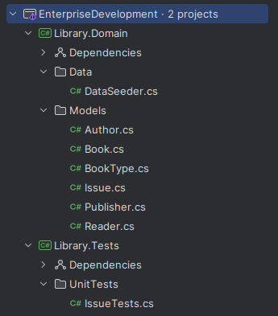
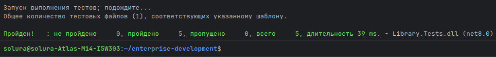

# 📚 Enterprise Development — Lab 1
**Variant 72 — Library**

---

## 📖 Task
Implement an object data model for the domain area **"Library"**, with unit tests written using **xUnit** and LINQ queries.  
Test data is generated using **Bogus**.

---

## 🏗 Domain model

The subject area is a **Library**.  
Each entity represents a part of the library system. Dependencies are organized to reflect real-world relationships:

- **Author**  
  Stores information about book authors. Each author has initials and a last name.
    - One author may write multiple books.
    - A book may have multiple authors (many-to-many relationship).

- **Publisher**  
  A reference entity that represents publishing houses (e.g., *Eksmo*).
    - One publisher may release many books.

- **BookType**  
  A reference entity that stores categories of books (e.g., *Novel*, *Textbook*).
    - Helps classify each book.

- **Book**  
  Central entity that represents a library book.  
  Includes inventory number, catalog code, title, publication year, and links to **Publisher**, **BookType**, and a list of **Authors**.

- **Reader**  
  Represents a library visitor.  
  Stores full name, address, phone number, and registration date.
    - One reader may borrow multiple books.

- **Issue**  
  Represents a book borrowing record.  
  Stores the link to **Book**, link to **Reader**, issue date, and duration in days.

📂 **Project structure**:

## 🔗 Dependencies between entities

- **Book → BookType** (many-to-one)
- **Book → Publisher** (many-to-one)
- **Book ↔ Author** (many-to-many, via `AuthorIds`)
- **Issue → Book** (many-to-one)
- **Issue → Reader** (many-to-one)
- **Reader → Issue** (one-to-many)

This model allows us to simulate a real library system and perform analytical queries using LINQ.

---

## 🧪 Unit Tests

The following queries were implemented and tested:

1. **Issued books ordered by title**  
   Joins `Issue` and `Book` entities, returns all issued books sorted alphabetically.

2. **Top 5 readers by books read in a given period**  
   Filters `Issue` by date, groups by `ReaderId`, counts books, and returns top readers.

3. **Readers with the longest issue period (ordered by name)**  
   Finds the maximum `DaysCount` per reader, sorts by reader's full name.

4. **Top 5 publishers by issued books in the last year**  
   Joins `Issue → Book → Publisher`, groups by publisher, counts issued books.

5. **Top 5 least popular books in the last year**  
   Groups issues by book, counts usage, sorts ascending, and takes the least popular ones.

✅ All tests passed successfully.
### ✔️ Test results

📌 Notes

All entities are documented with XML comments.

DataSeeder generates realistic data with Bogus.

Unit tests use only LINQ for data queries.

Code follows .NET 8 standards and style conventions.

